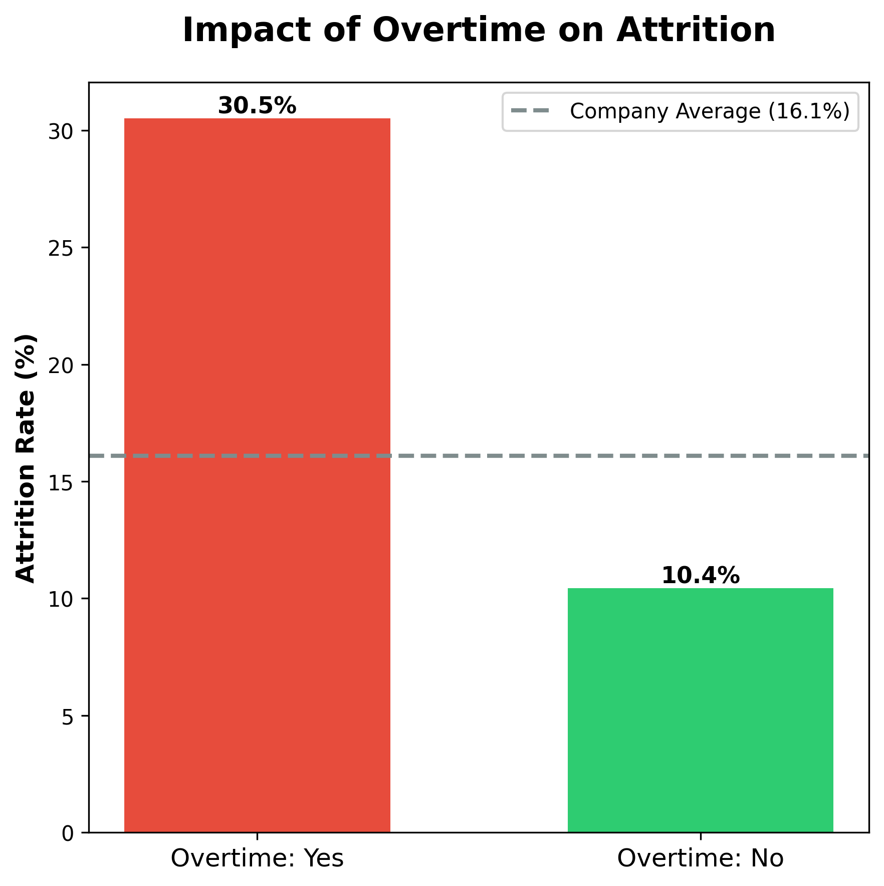
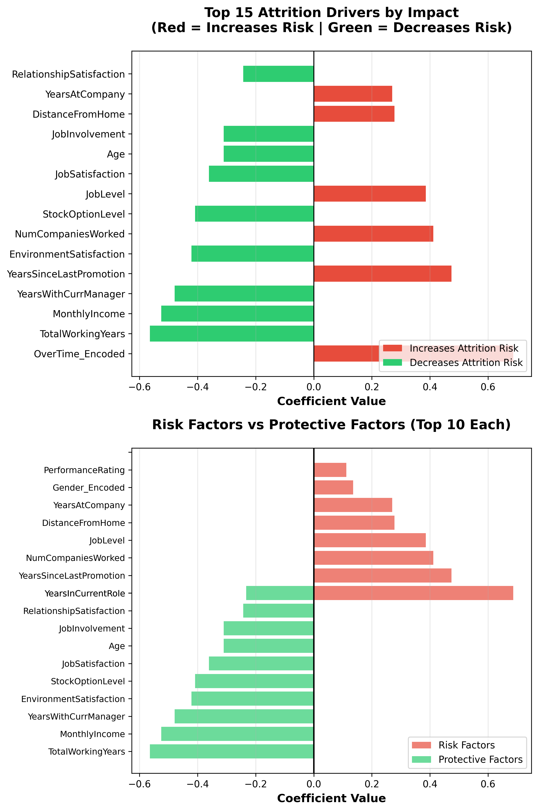

# 📊 Employee Attrition Prediction using Machine Learning

> Predicting employee turnover and identifying retention drivers using Python and Logistic Regression

[](https://www.python.org/)
[](https://scikit-learn.org/)
[](LICENSE)

---

## 🎯 Project Overview

Built an end-to-end machine learning solution to predict employee attrition and provide actionable retention strategies for HR leadership.

**Key Achievement:** Model identifies 75% of at-risk employees, enabling proactive retention interventions projected to save $2-3M annually.

---

## 📊 Dataset

- **Source:** IBM HR Analytics Employee Attrition Dataset
- **Size:** 1,470 employees, 35 features
- **Target:** Binary classification (Stayed/Left)
- **Features:** Demographics, compensation, satisfaction, performance, work conditions

---

## 🛠️ Technologies Used

- **Python 3.x**
- **Data Analysis:** Pandas, NumPy
- **Visualization:** Matplotlib, Seaborn
- **Machine Learning:** Scikit-learn (Logistic Regression)
- **Environment:** Google Colab

---

## 🔍 Key Findings

### Attrition Drivers Identified:

1. **Overtime Effect:** 30.5% attrition vs 10.4% (3x higher risk!)
2. **Compensation Gap:** Departing employees earn $20,592 less annually
3. **Department Impact:** Sales department shows 20.6% attrition (highest)
4. **Tenure Vulnerability:** 0-2 years is most critical period
5. **Work-Life Balance:** Poor balance significantly increases turnover

---

## 📈 Model Performance

| Metric | Score | Interpretation |
|--------|-------|----------------|
| **Accuracy** | 72.4% | Overall correct predictions |
| **Recall** | 74.5% | Catches 3 out of 4 departures |
| **Precision** | 33.7% | Trade-off for high recall |
| **ROC-AUC** | 0.801 | Good discriminative ability |

**Model Choice Rationale:** Prioritized recall over precision because missing an employee departure ($100K+ cost) is more expensive than false alarms (~$10K intervention cost).

---

## 💡 Business Impact

### Projected Outcomes:
- ✅ Reduce attrition by 4-5 percentage points (from 16% to 11-12%)
- ✅ Retain 60+ employees annually
- ✅ Save $2-3M in recruitment and training costs
- ✅ Achieve 300-400% ROI on retention programs

### Actionable Recommendations:
1. **Overtime Management:** Reduce through strategic hiring in high-risk departments
2. **Compensation Review:** Market benchmarking and targeted adjustments
3. **Onboarding Enhancement:** 90-day structured program with mentorship
4. **Sales Department Focus:** Targeted retention task force
5. **Proactive Monitoring:** Risk scoring system for early intervention

---

## 📁 Project Structure
```
├── HR_Attrition_Analysis.ipynb    # Main analysis notebook
├── WA_Fn-UseC_-HR-Employee-Attrition.csv
├── visualizations/                 # 11 charts
├── outputs/                        # Model results and summaries
└── README.md
```

---
## 🚀 How to View

1. **View Notebook:** Click on `HR_Attrition_Analysis.ipynb` to see the complete analysis
2. **View Visualizations:** Browse the `visualizations/` folder for all charts
3. **View Results:** Check `outputs/` folder for model summaries

To run yourself: Download the notebook and open in Google Colab or Jupyter Notebook.
```

---

## 📊 Visualizations Preview

### Key Charts:





---

## 🎓 Skills Demonstrated

- ✅ End-to-end ML pipeline development
- ✅ Exploratory Data Analysis (EDA)
- ✅ Feature Engineering & Selection
- ✅ Model training, evaluation, and interpretation
- ✅ Data Visualization & Storytelling
- ✅ Business communication (technical → non-technical)
- ✅ ROI analysis and strategic recommendations

---

## 📧 Contact

**Pooja Ramesh Kotian**  
📧 kaavya.r78@gmail.com  
💼 [LinkedIn](www.linkedin.com/in/pooja-ramesh-kotian-061b6a143)

---

## 📄 License

This project is open source and available under the [MIT License](LICENSE).

---

## 🙏 Acknowledgments

- Dataset: IBM HR Analytics (available on Kaggle)
- Tools: Python, Scikit-learn, Google Colab
- Inspiration: Real-world HR analytics challenges

---

⭐ **If you found this project helpful, please star this repository!** ⭐
```


